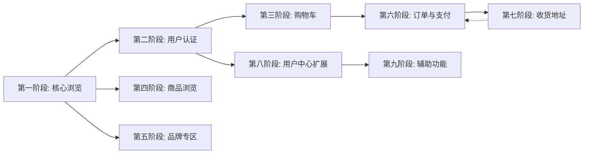

# Vue2 → Vue3 页面迁移进度表

> 源项目：[mall-app-web](https://github.com/macrozheng/mall-app-web)（Vue2） → 目标项目：mall-app-vue3（Vue3）
>
> 迁移策略：按页面逐个迁移，按业务功能分阶段推进

---

## 迁移总览

| 统计项   | 数量    | 页面                                               |
| -------- | ------- | -------------------------------------------------- |
| 总页面数 | 27      |                                                    |
| 已完成   | 25      | ✅✅✅✅✅✅✅✅✅✅✅✅✅✅✅✅✅✅✅✅✅✅✅✅✅ |
| 待迁移   | 2       | ☐☐                                                 |
| 完成率   | **92%** |                                                    |

---

## 迁移进度（按业务功能分组）

### 第一阶段：核心浏览与导航（已完成 ✅）

| 序号 | 页面路径                   | 功能 | 源文件                        | 代码量 | 状态      | 完成日期 |
| ---- | -------------------------- | ---- | ----------------------------- | ------ | --------- | -------- |
| 1    | `/pages/index/index`       | 首页 | `pages/index/index.vue`       | -      | ✅ 已完成 | -        |
| 2    | `/pages/category/category` | 分类 | `pages/category/category.vue` | -      | ✅ 已完成 | -        |
| 3    | `/pages/user/user`         | 我的 | `pages/user/user.vue`         | 9.4KB  | ✅ 已完成 | -        |

### 第二阶段：用户认证（已完成 ✅）

| 序号 | 页面路径                 | 功能 | 源文件                      | 代码量 | 状态      | 完成日期   |
| ---- | ------------------------ | ---- | --------------------------- | ------ | --------- | ---------- |
| 4    | `/pages/public/login`    | 登录 | `pages/public/login.vue`    | -      | ✅ 已完成 | 2026-04-28 |
| 5    | `/pages/public/register` | 注册 | `pages/public/register.vue` | -      | ✅ 已完成 | -          |
| 6    | `/pages/set/set`         | 设置 | `pages/set/set.vue`         | -      | ✅ 已完成 | -          |

### 第三阶段：购物车（已完成 ✅）

| 序号 | 页面路径           | 功能   | 源文件                | 代码量 | 状态      | 完成日期 |
| ---- | ------------------ | ------ | --------------------- | ------ | --------- | -------- |
| 7    | `/pages/cart/cart` | 购物车 | `pages/cart/cart.vue` | -      | ✅ 已完成 | -        |

### 第四阶段：商品浏览（已完成 ✅）

> 依赖：首页已迁移，可直接从首页跳转进入

| 序号 | 页面路径                        | 功能     | 源文件                             | 代码量 | 状态      | 完成日期   |
| ---- | ------------------------------- | -------- | ---------------------------------- | ------ | --------- | ---------- |
| 8    | `/pages/product/product`        | 商品详情 | `pages/product/product.vue`        | 32.9KB | ✅ 已完成 | 2026-04-28 |
| 9    | `/pages/product/list`           | 商品列表 | `pages/product/list.vue`           | 9.5KB  | ✅ 已完成 | 2026-04-28 |
| 10   | `/pages/product/hotProductList` | 热门商品 | `pages/product/hotProductList.vue` | 4.0KB  | ✅ 已完成 | 2026-04-30 |
| 11   | `/pages/product/newProductList` | 新品商品 | `pages/product/newProductList.vue` | 4.0KB  | ✅ 已完成 | 2026-04-30 |

### 第五阶段：品牌专区（已完成 ✅）

> 依赖：首页品牌推荐入口，商品详情页品牌信息

| 序号 | 页面路径                   | 功能     | 源文件                        | 代码量 | 状态      | 完成日期   |
| ---- | -------------------------- | -------- | ----------------------------- | ------ | --------- | ---------- |
| 12   | `/pages/brand/list`        | 品牌列表 | `pages/brand/list.vue`        | 3.8KB  | ✅ 已完成 | 2026-04-30 |
| 13   | `/pages/brand/brandDetail` | 品牌详情 | `pages/brand/brandDetail.vue` | 8.2KB  | ✅ 已完成 | 2026-04-30 |

### 第六阶段：订单与支付（进行中 🔧）

> 依赖：购物车结算、收货地址

| 序号 | 页面路径                   | 功能     | 源文件                        | 代码量 | 状态      | 完成日期   |
| ---- | -------------------------- | -------- | ----------------------------- | ------ | --------- | ---------- |
| 14   | `/pages/order/createOrder` | 创建订单 | `pages/order/createOrder.vue` | 20.2KB | ✅ 已完成 | 2026-05-06 |
| 15   | `/pages/order/order`       | 订单列表 | `pages/order/order.vue`       | 13.8KB | ✅ 已完成 | 2026-05-06 |
| 16   | `/pages/order/orderDetail` | 订单详情 | `pages/order/orderDetail.vue` | 19.5KB | ✅ 已完成 | 2026-05-07 |
| 17   | `/pages/money/pay`         | 支付     | `pages/money/pay.vue`         | 3.6KB  | ✅ 已完成 | 2026-05-07 |
| 18   | `/pages/money/paySuccess`  | 支付成功 | `pages/money/paySuccess.vue`  | 1.8KB  | ✅ 已完成 | 2026-05-07 |

### 第七阶段：收货地址（已完成 ✅）

> 依赖：创建订单选择地址

| 序号 | 页面路径                       | 功能         | 源文件                            | 代码量 | 状态      | 完成日期   |
| ---- | ------------------------------ | ------------ | --------------------------------- | ------ | --------- | ---------- |
| 19   | `/pages/address/address`       | 收货地址列表 | `pages/address/address.vue`       | 4.0KB  | ✅ 已完成 | 2026-04-30 |
| 20   | `/pages/address/addressManage` | 地址编辑     | `pages/address/addressManage.vue` | 5.8KB  | ✅ 已完成 | 2026-04-30 |

### 第八阶段：用户中心扩展（待迁移）

> 依赖：用户页已迁移，从用户页各功能入口进入

| 序号 | 页面路径                        | 功能         | 源文件                             | 代码量 | 状态      | 完成日期   |
| ---- | ------------------------------- | ------------ | ---------------------------------- | ------ | --------- | ---------- |
| 21   | `/pages/userinfo/userinfo`      | 个人信息编辑 | `pages/userinfo/userinfo.vue`      | -      | ☐ 待迁移  |            |
| 22   | `/pages/coupon/couponList`      | 优惠券列表   | `pages/coupon/couponList.vue`      | -      | ✅ 已完成 | 2026-05-06 |
| 23   | `/pages/user/productCollection` | 商品收藏     | `pages/user/productCollection.vue` | 4.5KB  | ✅ 已完成 | 2026-04-30 |
| 24   | `/pages/user/brandAttention`    | 品牌关注     | `pages/user/brandAttention.vue`    | 4.4KB  | ✅ 已完成 | 2026-04-30 |
| 25   | `/pages/user/readHistory`       | 浏览记录     | `pages/user/readHistory.vue`       | 4.6KB  | ✅ 已完成 | 2026-04-30 |

### 第九阶段：辅助功能（待迁移）

> 依赖：低优先级，无强依赖

| 序号 | 页面路径               | 功能     | 源文件                    | 代码量 | 状态      | 完成日期   |
| ---- | ---------------------- | -------- | ------------------------- | ------ | --------- | ---------- |
| 26   | `/pages/notice/notice` | 消息通知 | `pages/notice/notice.vue` | -      | ✅ 已完成 | 2026-05-06 |
| 27   | `/pages/money/money`   | 钱包     | `pages/money/money.vue`   | 0.2KB  | ☐ 待迁移  |            |

---

## 迁移顺序说明

页面迁移按照**业务主流程优先**的原则排列，核心逻辑是：

```
浏览商品 → 登录认证 → 加入购物车 → 选择地址 → 创建订单 → 支付完成
```

各阶段之间的依赖关系：



**关键说明**：

1. **第四阶段（商品浏览）**优先级最高，因为商品详情页是核心转化页面，且代码量最大（32.9KB）
2. **第七阶段（收货地址）**需在第六阶段（订单与支付）之前或同期完成，因为创建订单需要选择地址
3. **第八阶段（用户中心扩展）**可在第六阶段之后独立推进
4. **第九阶段（辅助功能）**优先级最低，可最后迁移

---

## 状态说明

| 标记      | 含义                                          |
| --------- | --------------------------------------------- |
| ✅ 已完成 | 页面已迁移至 Vue3，编译通过且 UI/功能验证通过 |
| 🔧 进行中 | 正在迁移中                                    |
| ☐ 待迁移  | 尚未开始迁移                                  |
| ❌ 阻塞   | 存在阻塞问题，暂时无法迁移                    |
